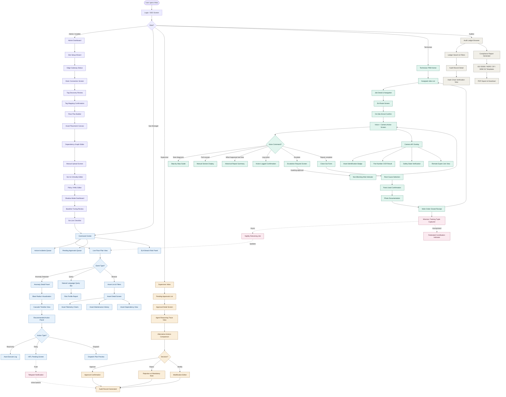

# ATLAS — App Screens & Flow Map

This document maps every screen in the Atlas app to the deployment phase and user role that drives it. Use this as the source of truth for design and routing.

---

## Diagram 1 — Full App Flow (All Roles, All Phases)



---

## Diagram 2 — Screen Inventory by Role (Sitemap)

```mermaid
flowchart LR
    App[Atlas App]

    App --> AdminRole[Admin / Installer]
    App --> OpsRole[Operations Manager]
    App --> SupRole[Supervisor]
    App --> TechRole[Technician PWA]
    App --> AuditRole[Auditor]

    AdminRole --> ADM1[Site Setup Wizard]
    AdminRole --> ADM2[Edge Gateway Status]
    AdminRole --> ADM3[Brain Connection]
    AdminRole --> ADM4[Tag Discovery & Mapping]
    AdminRole --> ADM5[Floor Plan Builder]
    AdminRole --> ADM6[Asset Placement Canvas]
    AdminRole --> ADM7[Dependency Graph Editor]
    AdminRole --> ADM8[Manual Library]
    AdminRole --> ADM9[SLA & Criticality]
    AdminRole --> ADM10[Policy YAML Editor]
    AdminRole --> ADM11[Shadow Mode Review]
    AdminRole --> ADM12[Baseline Tuning]
    AdminRole --> ADM13[Go-Live Checklist]
    AdminRole --> ADM14[User & Role Management]

    OpsRole --> OPS1[Command Center / Floor Plan]
    OpsRole --> OPS2[Active Incidents Queue]
    OpsRole --> OPS3[Asset Detail View]
    OpsRole --> OPS4[Telemetry Charts]
    OpsRole --> OPS5[Maintenance History]
    OpsRole --> OPS6[Natural Language Query]
    OpsRole --> OPS7[Risk Profile Reports]
    OpsRole --> OPS8[SLA Breach Dashboard]
    OpsRole --> OPS9[Dispatch Plan Preview]
    OpsRole --> OPS10[Pending Approvals Queue]
    OpsRole --> OPS11[Technician Locator Map]
    OpsRole --> OPS12[Parts Inventory View]

    SupRole --> SUP1[Approval Inbox]
    SupRole --> SUP2[Approval Detail]
    SupRole --> SUP3[Reasoning Trace Viewer]
    SupRole --> SUP4[Alternative Actions]
    SupRole --> SUP5[Approval History]
    SupRole --> SUP6[Telegram Bot - external]

    TechRole --> TEC1[Jobs List]
    TechRole --> TEC2[Job Detail & Navigation]
    TechRole --> TEC3[Voice + Camera Active]
    TechRole --> TEC4[Step-by-Step Guide]
    TechRole --> TEC5[Manual Section Display]
    TechRole --> TEC6[Historical Repair Summary]
    TechRole --> TEC7[Camera AR Overlay]
    TechRole --> TEC8[Part Number OCR]
    TechRole --> TEC9[Safety State Indicator]
    TechRole --> TEC10[Remote Expert Video]
    TechRole --> TEC11[Action Log Confirmation]
    TechRole --> TEC12[Escalation Request]
    TechRole --> TEC13[Approval Wait Indicator]
    TechRole --> TEC14[Close-Out Form]
    TechRole --> TEC15[Photo Documentation]
    TechRole --> TEC16[Settings & Profile]

    AuditRole --> AUD1[Ledger Search]
    AuditRole --> AUD2[Audit Record Detail]
    AuditRole --> AUD3[Hash Chain Verifier]
    AuditRole --> AUD4[Compliance Report Generator]
    AuditRole --> AUD5[Report Templates Library]
    AuditRole --> AUD6[Export Center]

    classDef admin fill:#EEEDFE,stroke:#534AB7,color:#26215C
    classDef ops fill:#E6F1FB,stroke:#185FA5,color:#042C53
    classDef sup fill:#FAEEDA,stroke:#854F0B,color:#412402
    classDef tech fill:#E1F5EE,stroke:#0F6E56,color:#04342C
    classDef audit fill:#F1EFE8,stroke:#5F5E5A,color:#2C2C2A

    class AdminRole,ADM1,ADM2,ADM3,ADM4,ADM5,ADM6,ADM7,ADM8,ADM9,ADM10,ADM11,ADM12,ADM13,ADM14 admin
    class OpsRole,OPS1,OPS2,OPS3,OPS4,OPS5,OPS6,OPS7,OPS8,OPS9,OPS10,OPS11,OPS12 ops
    class SupRole,SUP1,SUP2,SUP3,SUP4,SUP5,SUP6 sup
    class TechRole,TEC1,TEC2,TEC3,TEC4,TEC5,TEC6,TEC7,TEC8,TEC9,TEC10,TEC11,TEC12,TEC13,TEC14,TEC15,TEC16 tech
    class AuditRole,AUD1,AUD2,AUD3,AUD4,AUD5,AUD6 audit
```



---

## Diagram 3 — Incident Lifecycle Screens (The Demo Path)

This is the screen sequence the judges will see end-to-end.

```mermaid
flowchart TD
    Start([Telemetry drift detected]) --> D1[Command Center: Floor Plan]
    D1 -->|Asset flips red| D2[Anomaly Detail Panel slides in]
    D2 --> D3[Blast Radius lights up downstream nodes]
    D3 --> D4[Cascade Timeline overlay with countdowns]
    D4 --> D5[Recommended Action Panel: dispatch + bypass]

    D5 --> D6[Hermes Dispatch Plan Preview]
    D6 --> D7[Technician + parts + ETA shown on map]

    D7 -->|Bypass action triggers policy| D8[HITL Pending Screen]
    D8 -.->|Telegram push| D9[Supervisor Phone: Approval Card]
    D9 -->|Tap approve + note| D10[Audit Record Generated]
    D10 --> D11[Approval Confirmation appears in Command Center]

    D11 --> D12[Switch to Technician PWA]
    D12 --> D13[Job Detail with route]
    D13 --> D14[On-Site: Voice + Camera Active]
    D14 -->|Voice: start diagnosis| D15[Step-by-Step Guide opens]
    D15 -->|Voice: what happened last time| D16[Historical Repair Summary]
    D16 --> D17[Camera AR identifies asset]
    D17 --> D18[Safety State verified - green badge]
    D18 --> D19[Tech performs repair, voice logs each step]

    D19 --> D20[Voice: repair complete]
    D20 --> D21[Close-Out Form]
    D21 --> D22[Root Cause + Parts confirmed]
    D22 --> D23[Work Order Closed Receipt]

    D23 -.->|Async| D24[Mnemos: Training Tuple Captured toast]
    D24 -.->|Async| D25[Federated Contribution: 1 signature shared]

    classDef ops fill:#E6F1FB,stroke:#185FA5,color:#042C53
    classDef sup fill:#FAEEDA,stroke:#854F0B,color:#412402
    classDef tech fill:#E1F5EE,stroke:#0F6E56,color:#04342C
    classDef async fill:#FBEAF0,stroke:#993556,color:#4B1528

    class D1,D2,D3,D4,D5,D6,D7,D11 ops
    class D8,D9,D10 sup
    class D12,D13,D14,D15,D16,D17,D18,D19,D20,D21,D22,D23 tech
    class D24,D25 async
```



---

## Screen Priority for Hackathon Build

**Build first (demo critical):**
- Command Center / Floor Plan (D1)
- Anomaly Detail Panel + Blast Radius (D2-D4)
- Dispatch Plan Preview (D6-D7)
- HITL Pending Screen + Telegram approval (D8-D11)
- Technician PWA: Job Detail, Voice + Camera Active, Step-by-Step (D12-D19)
- Close-Out Form (D21-D23)
- Mnemos + Federated toasts (D24-D25)

**Build second (if time permits):**
- Asset Detail View with telemetry charts
- Natural Language Query bar in Command Center
- Pending Approvals Queue (web version)
- Audit Record Detail with hash chain

**Skip for hackathon (mention in voiceover):**
- All Phase 0–3 admin screens (site setup, brain connection, tag discovery, floor plan builder, dependency editor, shadow mode review)
- User & role management
- Compliance report generator
- Parts inventory view

---

## Routing Structure (Next.js App Router)

```
app/
├── (auth)/
│   └── login/
├── admin/                          # Admin / Installer
│   ├── setup/
│   ├── gateway/
│   ├── brain/
│   ├── tags/
│   ├── floor-plan/
│   ├── dependencies/
│   ├── manuals/
│   ├── slas/
│   ├── policies/
│   ├── shadow-mode/
│   └── go-live/
├── ops/                            # Operations Manager
│   ├── command-center/             # default landing
│   ├── incidents/
│   ├── assets/[id]/
│   ├── query/
│   ├── reports/
│   ├── approvals/
│   └── parts/
├── supervisor/                     # Supervisor
│   ├── inbox/
│   ├── approvals/[id]/
│   └── history/
├── tech/                           # Technician PWA (separate manifest)
│   ├── jobs/
│   ├── jobs/[id]/
│   ├── jobs/[id]/active/           # voice + camera screen
│   ├── jobs/[id]/close/
│   └── settings/
└── audit/                          # Auditor
    ├── ledger/
    ├── records/[id]/
    ├── verify/
    └── reports/
```
